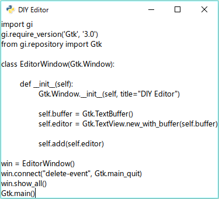

# テキストボックスを作る

次にテキストを入力出来るようにしましょう。

```python
import gi
gi.require_version('Gtk', '3.0')
from gi.repository import Gtk

class EditorWindow(Gtk.Window):

	def __init__(self):
		Gtk.Window.__init__(self, title="DIY Editor")
        self.set_default_size(640, 480)

		self.buffer = Gtk.TextBuffer()
		self.editor = Gtk.TextView.new_with_buffer(self.buffer)

		self.add(self.editor)

win = EditorWindow()
win.connect("delete-event", Gtk.main_quit)
win.show_all()
Gtk.main()
```

急にコードの雰囲気が変わりましたね。  
何の説明も無しにクラスを使い始めてしまいましたが、説明すると長くなるので省略します。

ここではウィンドウにテキストボックスを追加しています。  
`self.buffer = Gtk.TextBuffer()`では、生成したバッファ(編集中の内容などを管理するもの)をEditorWindowのbufferに格納し、  
`self.editor = Gtk.TextView.new_with_buffer(self.buffer)`で、バッファをもとにテキストボックスを生成しています。  
生成したテキストボックスは`self.add(self.editor)`でEditorWindowに追加しています。

さて今のところ、こんな感じになっているはずです。



うーん、殺風景(笑)  
これでプログラミングをする気にはならないですよね……。

なのでここで魔法をかけます。

```python
import gi
gi.require_version('Gtk', '3.0')
from gi.repository import Gtk
gi.require_version('GtkSource', '3.0')
from gi.repository import GtkSource

class EditorWindow(Gtk.Window):

	def __init__(self):
		Gtk.Window.__init__(self, title="DIY Editor")
        self.set_default_size(640, 480)

		self.buffer = GtkSource.Buffer()
		self.editor = GtkSource.View.new_with_buffer(self.buffer)

		lang_manager = GtkSource.LanguageManager()
		self.buffer.set_language(lang_manager.get_language('python'))
		self.add(self.editor)

win = EditorWindow()
win.connect("delete-event", Gtk.main_quit)
win.show_all()
Gtk.main()
```

えっ、何が変わったの？

ジャジャーン！


一瞬でシンタックスハイライトが導入出来ました。  
変わった部分について見ていきましょう。

```python
# ライブラリの読み込みを追加した
gi.require_version('GtkSource', '3.0')
from gi.repository import GtkSource
```

```python
# Gtk.Text~をGtkSourceに変えた
self.buffer = GtkSource.Buffer()
self.editor = GtkSource.View.new_with_buffer(self.buffer)

# ハイライトする言語を設定している
lang_manager = GtkSource.LanguageManager()
self.buffer.set_language(lang_manager.get_language('python'))
```

あらかじめインストールしておいたGTKSourceViewがここで登場します。  
ソースコードをハイライトするためのライブラリだったんですね。  
ていうか、こんなに簡単で本当にいいんでしょうか……？

あえて言いましょう。  
いいんです！

これであとファイルを開いたり保存したり出来れば、もうメモ帳とはおさらばだぜ！  

と、その前に。  
気付いた人もいると思いますが、長いソースコードを開くとウィンドウがその長さに合わせて大きくなってしまいますね。  
これだと縦方向に無限の長さを持つディスプレイが必要に……。

普通のエディタでは横にスクロールバーが付いていますよね。  
パパッとスクロールバーを付けてみましょう。

`EditorWindow`の`__init__`メソッドを以下のようにしてみてください。

```python
def __init__(self):
	Gtk.Window.__init__(self, title="DIY Editor")
    self.set_default_size(640, 480)
    self.buffer = GtkSource.Buffer()
    self.editor = GtkSource.View.new_with_buffer(self.buffer)

    lang_manager = GtkSource.LanguageManager()
    self.buffer.set_language(lang_manager.get_language('python'))

    self.__sw = Gtk.ScrolledWindow()
    self.__sw.set_hexpand(True)
    self.__sw.set_vexpand(True)
    self.__sw.add(self.editor)
    self.add(self.__sw)
```

`self.editor`を`self.__sw`でラップしました。  
`Gtk.ScrolledWindow`を使うと、様々なウィジェットにスクロールバーを追加出来るのです。  
その後の`set_hexpand(True)`で水平方向、`set_vexpand(True)`で垂直方向のスクロールバーを設定しています。

さて、コードが書きやすくなったところで、次はメニューバーを作っていきます。