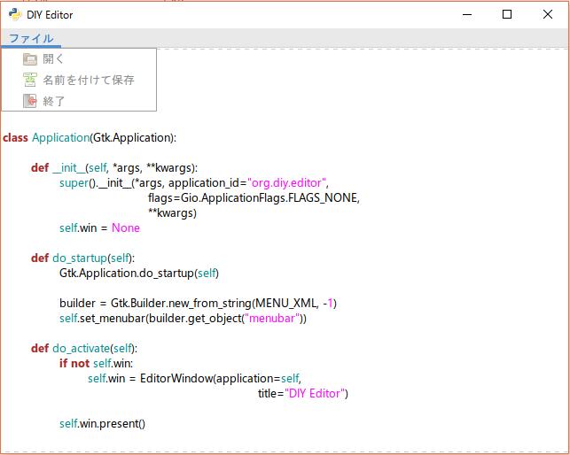

# メニューバーを作る

普段、ファイルを開いたり保存したりって、どうやっていますか？  
多くのエディタにはメニューバーがあって、そこの項目から行うのが普通だと思います。  
ショートカットキーでも保存できるじゃん！と思うかもしれませんが、どのみちメニューバーが必要になります。

なのでまずはメニューバーを作りましょう。  
少し長くなるので、`MENU_XML`あたりはコピペでも大丈夫です。

`EditorWindow`クラスはあまり大きくいじってないので、差異を見つけて修正してください。

```python
import sys, gi
gi.require_version('Gtk', '3.0')
gi.require_version('GtkSource', '3.0')
from gi.repository import Gtk, GtkSource, Gio, GLib

MENU_XML="""
<?xml version="1.0" encoding="UTF-8"?>
<interface>
	<menu id="menubar">
		<submenu>
			<attribute name="label" translatable="yes">ファイル</attribute>
			<section>
			<item>
				<attribute name="action">win.open</attribute>
				<attribute name="label" translatable="yes">開く</attribute>
                <attribute name="icon">document-open</attribute>
			</item>
			<item>
				<attribute name="action">win.save_as</attribute>
				<attribute name="label" translatable="yes">名前を付けて保存</attribute>
                <attribute name="icon">document-save-as</attribute>
			</item>
            <item>
                <attribute name="action">win.quit</attribute>
                <attribute name="label" translatable="yes">終了</attribute>
                <attribute name="icon">application-exit</attribute>
            </item>
			</section>
		</submenu>
	</menu>
</interface>
"""


class Application(Gtk.Application):

	def __init__(self, *args, **kwargs):
		super().__init__(*args, application_id="org.diy.editor",
				         flags=Gio.ApplicationFlags.FLAGS_NONE,
				         **kwargs)
		self.win = None

	def do_startup(self):
		Gtk.Application.do_startup(self)

		builder = Gtk.Builder.new_from_string(MENU_XML, -1)
		self.set_menubar(builder.get_object("menubar"))

	def do_activate(self):
		if not self.win:
			self.win = EditorWindow(application=self,
									title="DIY Editor")

		self.win.present()


class EditorWindow(Gtk.ApplicationWindow):

	def __init__(self, *args, **kwargs):
		super().__init__(*args, **kwargs)

		self.set_default_size(640, 480)

		self.buffer = GtkSource.Buffer()
		self.editor = GtkSource.View.new_with_buffer(self.buffer)

		lang_manager = GtkSource.LanguageManager()
		self.buffer.set_language(lang_manager.get_language('python'))

		self.__sw = Gtk.ScrolledWindow()
		self.__sw.set_hexpand(True)
		self.__sw.set_vexpand(True)
		self.__sw.add(self.editor)
		self.add(self.__sw)

		self.show_all()

if __name__ == "__main__":
	app = Application()
	app.run(sys.argv)

```

追加したところを1つずつ見ていきましょう。  
まずはimportしているライブラリ群から。

```python
import os, sys, gi
gi.require_version('Gtk', '3.0')
gi.require_version('GtkSource', '3.0')
from gi.repository import Gtk, GtkSource, Gio, GLib
```

`gi`に加えて`os`と`sys`というライブラリを読み込んでいます。  
これはPythonの標準ライブラリで、今回はファイルの入出力や、コマンドラインオプションを扱うために利用します。  
さらに、追加で`gi.repository`から`Gio`と`GLib`を読み込んでいます。    
これらはメニューバーのアクションを作成するのに用います。

次に`MENU_XML`を見てみましょう。

```xml
<?xml version="1.0" encoding="UTF-8"?>
<interface>
    <menu id="menubar">
        <submenu>
            <attribute name="label" translatable="yes">ファイル</attribute>
            <section>
            <item>
				<attribute name="action">win.open</attribute>
				<attribute name="label" translatable="yes">開く</attribute>
                <attribute name="icon">document-open</attribute>
			</item>
			<item>
				<attribute name="action">win.save_as</attribute>
				<attribute name="label" translatable="yes">名前を付けて保存</attribute>
                <attribute name="icon">document-save-as</attribute>
			</item>
            <item>
                <attribute name="action">win.quit</attribute>
                <attribute name="label" translatable="yes">終了</attribute>
                <attribute name="icon">application-exit</attribute>
            </item>
			</section>
		</submenu>
	</menu>
</interface>
```

これでメニューバーの項目などを定義しています。  
本来は別のファイルに分けるべきですが、量も少ないので同じファイルに書いてしまいます。  
XMLの文法については詳しく触れません。

大事なところは`<submenu>...</submenu>`の部分で、これがメニューバーの項目1つに相当します。  
他は`attribute`の`name`属性を見れば大体分かると思います。  
`action`がソースコードとリンクする部分で、ここの中に書かれたアクションが項目選択時に実行されます。  
`icon`は項目のアイコンを指定している部分で、[Icon Naming Specification](https://developer.gnome.org/icon-naming-spec/)
に書かれているものについては新たにアイコンを用意しなくても表示可能です。

最後に`Application`クラスを見てください。  

```python
class Application(Gtk.Application):

	def __init__(self, *args, **kwargs):
		super().__init__(*args, application_id="org.diy.editor",
				         flags=Gio.ApplicationFlags.FLAGS_NONE,
				         **kwargs)
		self.win = None

	def do_startup(self):
		Gtk.Application.do_startup(self)

		builder = Gtk.Builder.new_from_string(MENU_XML, -1)
		self.set_menubar(builder.get_object("menubar"))

	def do_activate(self):
		if not self.win:
			self.win = EditorWindow(application=self,
									title="DIY Editor")

		self.win.present()
```

これはモダンなGUIアプリケーションのための便利クラスで、最近はこれを用いることが推奨されています。  
具体的には、コマンドラインオプションを良い感じに扱ってくれたり、メニューバー関連の諸々を処理してくれたりします。

大事なところは`do_startup`と`do_activate`で、`app.run()`によってこの順番で実行されます。    
※新たにメソッドを追加しているように見えますが、実は親クラスのメソッドをオーバーライドしているだけです。

始めに`do_startup`の説明から。  
`builder = Gtk.Builder.new_from_string(MENU_XML, -1)`でMENU_XMLを解釈して、設計図のようなものを`builder`に代入しています。  
次の行の`self.set_menubar(builder.get_object("menubar"))`では先ほどの`builder`から`"menubar"`という`id`が付いた項目をメニューバーとして設定しています。  
ちなみに、`MENU_XML`の記述が間違っているとプログラムが強制終了します。

そして`do_activate`ですが、今回はここでEditorWindowを生成しています。  
`self.win.present()`でOSのウィンドウマネージャの操作対象を生成したウィンドウに当てています。

ここまでで全てが上手く行っていれば、こんな感じになっているはずです。  
※`EditorWindow`の修正も忘れずに。



だんだん形になってきましたね。  
次の頁では実際にメニューバーにアクションを追加してみます。

これでひとまずメモ帳を卒業出来る……！！