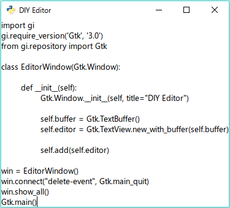
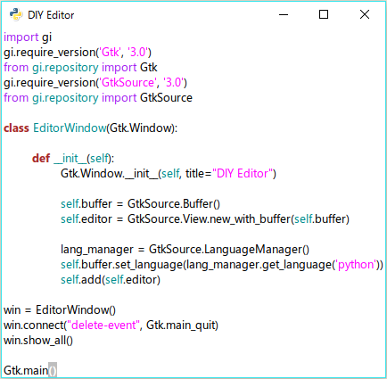

# テキストエディタを作ろう
さて、それでは早速DIYを始めましょう。  
初めのお題は**「テキストエディタ」**です。

テキストエディタと言うと例のメモ帳を想像する人もいるでしょうが、ここで作るのは++プログラミングをするための++テキストエディタです。  
つまりAtomやSublime Text、はたまたVimもしくはEmacsを作ろうというわけです。

まあ、いきなりプラグインで機能を拡張出来るようなものは作りません(作ってもいいんですよ？)  
今回はメモ帳をちょっとだけ**プログラマ仕様**にしたものを作ります。  
具体的に言えば、コードに色が付いたり、F5を押すとコンパイルしたりするような感じです。

そしてこれからコードを書くにあたって、**nano・メモ帳と自分で作ったエディタ**以外のテキストエディタの利用を禁じます。

これには理由があって、実際に作ろうとしている類のアプリケーションを利用することで不便な点を見つけ出し、それを改善する機能を追加していってほしいからです。  

だから最初にテキストエディタを作ります。  
流石に**最初から最後までメモ帳**はマゾいでしょ？

それでは開発するテキストエディタの最低限の仕様を示します。

```
* テキストの入力が出来ること
* ファイルの入出力が出来ること
* 範囲選択・コピー・ペーストが出来ること
* アンドゥ
  履歴は最低でも1024回。可能ならばメモリが許す範囲まで戻せる。
  アンドゥの途中で新しく入力がされた場合は、それより先の編集履歴を消去。
* リドゥ
  アンドゥで戻した編集履歴を進める。
  最新の編集履歴まで進めることが出来る。
* 文字列の検索・置換が出来ること
* 行番号の表示が出来ること
```

これでメモ帳とほぼ同等にはなります。  
ただしメモ帳は何回もアンドゥ・リドゥが出来ないので、そこだけポイント高いですね(そもそもリドゥが無い)。


早速作っていきましょう。

まずはウィンドウを作成します。  
[さっきのコード](BeforeDIY.md)を覚えているでしょうか？

```python
import gi
gi.require_version('Gtk', '3.0')
from gi.repository import Gtk

win = Gtk.Window()
win.connect("delete-event", Gtk.main_quit)
win.show_all()
Gtk.main()
```

上の3行はGTKを利用するためのライブラリを読み込む部分なので、実際にウィンドウを生成する部分には関係ありません。  
重要なのは`win = Gtk.Window()`で、ここがウィンドウ生成部分です。  
※Windowの頭文字が大文字であることに注意しましょう。

これはウィンドウの実体をwinという変数に格納しています。  
次の行の`win.connect("delete-event", Gtk.main_quit)`は、ウィンドウの×ボタンを押した時に`Gtk.main_quit`を実行するという意味です。  
`Gtk.main_quit`は関数で、`Gtk.main`に対して正常な終了を要求するものです。

ここで覚えて欲しいのは、`*.connect`というメソッドの使い方です。  
これはGTKウィジェットに対してイベントハンドラを設定するもので、頻繁に登場します。  
先ほど見たようにこのメソッドは以下の2つの引数をとります。

```python
*.connect("シグナル名", コールバック関数)
```

今回のシグナルは全てのGTKウィジェットに共通して存在し、トップレベルのウィンドウが閉じられる直前に通知されるものです。  

ウィジェット共通のシグナルについてはAPIリファレンスの以下のページに全て載っています。  
http://lazka.github.io/pgi-docs/#Gtk-3.0/classes/Widget.html#signals

次にテキストを入力出来るようにしましょう。

```python
import gi
gi.require_version('Gtk', '3.0')
from gi.repository import Gtk

class EditorWindow(Gtk.Window):

	def __init__(self):
		Gtk.Window.__init__(self, title="DIY Editor")

		self.buffer = Gtk.TextBuffer()
		self.editor = Gtk.TextView.new_with_buffer(self.buffer)

		self.add(self.editor)

win = EditorWindow()
win.connect("delete-event", Gtk.main_quit)
win.show_all()
Gtk.main()
```

急にコードの雰囲気が変わりましたね。  
何の説明も無しにクラスを使い始めてしまいましが、説明すると長くなるので省略します。

さて今のところ、こんな感じになっているはずです。



うーん、殺風景(笑)  
これでプログラミングをする気にはならないですよね……。

なのでここで魔法をかけます。

```python
import gi
gi.require_version('Gtk', '3.0')
from gi.repository import Gtk
gi.require_version('GtkSource', '3.0')
from gi.repository import GtkSource

class EditorWindow(Gtk.Window):

	def __init__(self):
		Gtk.Window.__init__(self, title="DIY Editor")

		self.buffer = GtkSource.Buffer()
		self.editor = GtkSource.View.new_with_buffer(self.buffer)

		lang_manager = GtkSource.LanguageManager()
		self.buffer.set_language(lang_manager.get_language('python'))
		self.add(self.editor)

win = EditorWindow()
win.connect("delete-event", Gtk.main_quit)
win.show_all()
Gtk.main()
```

えっ、何が変わったの？

ジャジャーン！



一瞬でシンタックスハイライトが導入出来ました。  
変わった部分について見ていきましょう。

```python
# ライブラリの読み込みを追加した
gi.require_version('GtkSource', '3.0')
from gi.repository import GtkSource
```

```python
# Gtk.Text~をGtkSourceに変えた
self.buffer = GtkSource.Buffer()
self.editor = GtkSource.View.new_with_buffer(self.buffer)

# ハイライトする言語を設定している
lang_manager = GtkSource.LanguageManager()
self.buffer.set_language(lang_manager.get_language('python'))
```

あらかじめインストールしておいたGTKSourceViewがここで登場します。  
ソースコードをハイライトするためのライブラリだったんですね。  
ていうか、こんなに簡単で本当にいいんでしょうか……？

あえて言いましょう。  
いいんです！

これであとファイルを開いたり保存したり出来れば、もうメモ帳とはおさらばだぜ！  
早速やってみましょう。

まずメニューバーを追加します。

Work In Progress!